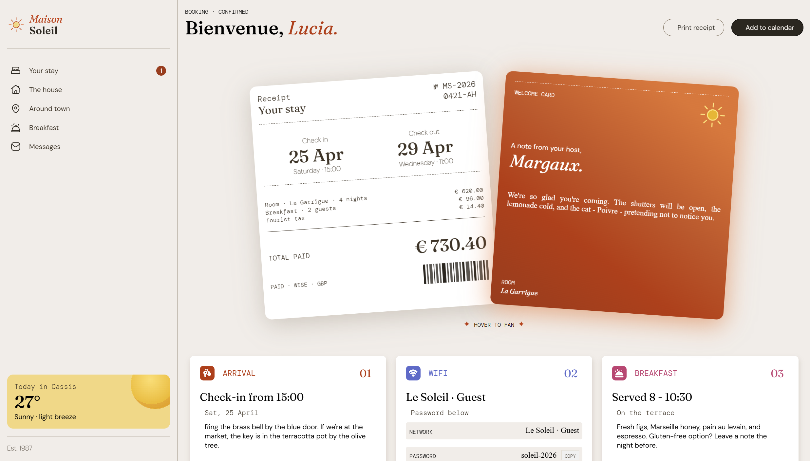

# Hotel Booking Confirmation Page

A responsive hotel booking confirmation page built as a Frontend Mentor challenge.

## Overview

This project is a hotel booking confirmation page designed to work across desktop and mobile screen sizes.

The page includes a branded sidebar, overlapping information cards, a booking receipt, a host note, and different sections for arrival, Wi-Fi, and breakfast information.

I also added several interactive and visual elements with JavaScript and CSS, including animations, hover effects, a mobile navigation menu, and a Wi-Fi password copy button.

## Built with

* HTML
* CSS
* JavaScript
* Flexbox
* Responsive design

## Features

* Responsive layout for desktop and mobile
* Mobile navigation menu
* Wi-Fi password copy button
* Hover and focus interactions
* Animated and interactive cards
* Gradient backgrounds
* Perspective movement on the middle cards
* Responsive card layout

## What I learned

One of the main things I practiced with this project was **Flexbox**. I hadn't used flex displays in a long time, and this project gave me a good opportunity to use them again.

I was surprised by how quickly Flexbox helped me handle the responsive layout. It made it much easier to organize the different cards and adapt the page to different screen sizes.

I also practiced using JavaScript for visual and interactive elements. I don't use JavaScript as often, so working on things like the card perspective effect, animations, the navigation menu, and the copy button was a good way to get more comfortable with it.

I also learned more about how CSS layout decisions can affect responsiveness. Some of the problems I encountered came from adding individual elements and flex containers before having a completely organized layout.

## Challenges

The main challenge was making the page responsive while keeping the visual design of the original reference.

Flexbox helped a lot, but I still encountered some issues on smaller screens. In particular, the mobile version currently has some bugs below around 400px wide, where the body can develop an unexpected horizontal offset.

I used the browser's web inspector extensively to test different values and understand where the problem was coming from. Changing some values directly in the inspector sometimes fixed the issue, which made it harder to identify the actual cause.

I suspect that some of the middle cards may be too large for very small screens, or that the way some of the layers are organized is contributing to the problem. I haven't completely identified the cause yet.

Another challenge was creating some of the visual effects with JavaScript. Since I don't use JavaScript that often, I had to experiment quite a bit to get the interactions to behave the way I wanted.

## What I'm proud of

I'm most proud of how the website turned out overall, especially the responsive design, the visual implementation, and the different components I created.

I'm particularly happy with the hover perspective movement of the middle cards. I made this effect with JavaScript, which isn't something I usually work with, so it was a nice opportunity to practice.

I'm also proud of how Flexbox helped me handle responsiveness much faster than I expected.

## What I would do differently

If I were to redo this project, I would prioritize the layout and responsiveness before adding every flex display and every card.

I think some of the issues I have on smaller screens could have been avoided by having a better layer and layout organization from the beginning.

I would also spend more time planning the structure of the page before implementing the individual visual elements. This would make the CSS easier to maintain and probably make the responsive behavior more predictable.

## Known issues

* The mobile layout can have a horizontal offset below approximately 400px wide.
* Some cards may need further adjustments for very small screen sizes.
* The exact cause of the mobile offset has not been fully identified yet.

## Links

* [Live website](#)
* [Frontend Mentor challenge](https://www.frontendmentor.io/)

## Credits

This project was created as part of a [Frontend Mentor](https://www.frontendmentor.io/) challenge.

Frontend Mentor provides realistic design challenges to practice HTML, CSS, JavaScript, and responsive web development.

## Result

